# Assignment 1
Name: 'Omer Alkaya'

Legi-Nr: '18-943-092'

## Required results
Edit this 'README.md' file to report all your results. You only need to update the tables in the reports section by adding screenshots and reporting results.

### Tasks
- Add a text dump of the content of the two data structures for the provided mesh “plane.off”.

- Show three screenshots of the 'fandisk.off' model using 'per-face shading', 'per-vertex shading' and 'per-corner shading'. Describe the difference between them.

- Show screenshots of the provided meshes with each connected component colored differently. Show the number of connected components and the size of each component (measured in number of faces) for all the provided models.

- Show screenshots of the subdivided meshes.

## Reports
### text dump of the data structure for "plane.off"
| Vertices-to-Face          | Vertices-to-Vertex        |
|---------------------------|---------------------------|
| Vertex: Face(s)           | Vertex: Adjacent Vertices |
| 0: 5 21                   | 0: 11 13 22               |
| 1: 31                     | 1: 9 12                   |
| 2: 10 26                  | 2: 10 15 23               |
| 3: 0                      | 3: 14 16                  |
| 4: 14 27 30               | 4: 9 10 20 24             |
| 5: 13 23 29               | 5: 11 12 19 24            |
| 6: 1 4 17                 | 6: 13 14 18 21            |
| 7: 2 8 18                 | 7: 15 16 17 21            |
| 8: 6 9 12 19 22 25        | 8: 17 18 19 20 22 23      |
| 9: 15 30 31               | 9: 1 4 12 24              |
| 10: 11 26 27              | 10: 2 4 20 23             |
| 11: 7 21 23               | 11: 0 5 19 22             |
| 12: 15 29 31              | 12: 1 5 9 24              |
| 13: 4 5 20                | 13: 0 6 18 22             |
| 14: 0 1 16                | 14: 3 6 16 21             |
| 15: 8 10 24               | 15: 2 7 17 23             |
| 16: 0 2 16                | 16: 3 7 14 21             |
| 17: 3 8 9 18 19 24        | 17: 7 8 15 18 21 23       |
| 18: 3 4 6 17 19 20        | 18: 6 8 13 17 21 22       |
| 19: 7 12 13 22 23 28      | 19: 5 8 11 20 22 24       |
| 20: 11 12 14 25 27 28     | 20: 4 8 10 19 23 24       |
| 21: 1 2 3 16 17 18        | 21: 6 7 14 16 17 18       |
| 22: 5 6 7 20 21 22        | 22: 0 8 11 13 18 19       |
| 23: 9 10 11 24 25 26      | 23: 2 8 10 15 17 20       |
| 24: 13 14 15 28 29 30     | 24: 4 5 9 12 19 20        |

### Show three screenshots of the 'fandisk.off' model using different shading. Make sure you disable the wireframe and that the screenshots clearly show the differences between the different shading types.
| model name  | per-face shading    | per-vertex shading |  per-corner shading |
| :---------: | ------------------- | ------------------ | ------------------- |
| fandisk     |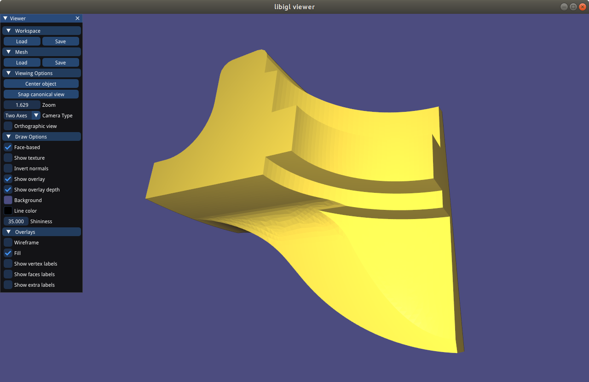| 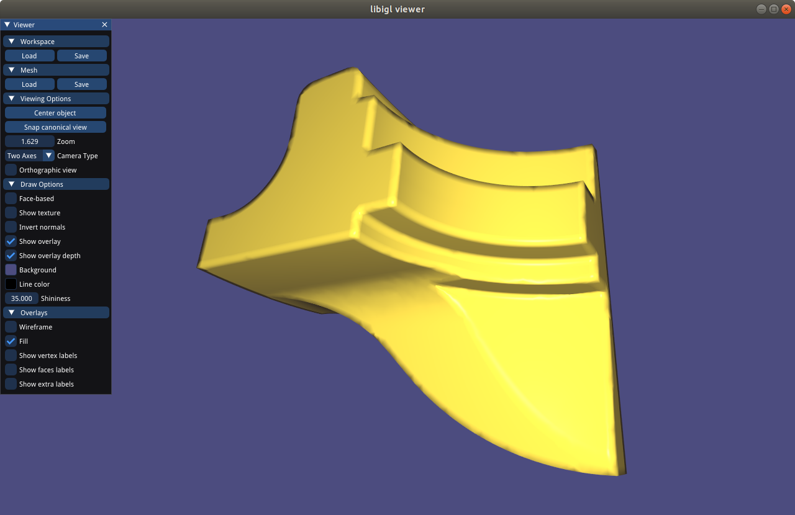 |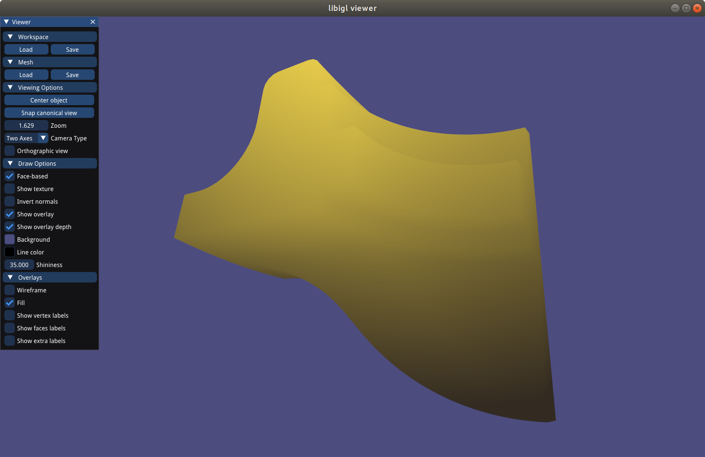  |

#### Briefly describe the difference between the different shading types.
Per-face: Each polygon is coloured based on angle between the surface normal and the direction of the light source. Additionally the colour of the surface, light source and the intensity of the light source effects the lighting.
Per-vertex: Normals are computed for each vertex by averaging normals of the surrounding faces.
Per-corner: Vertex normals are computed per adjascent face and a threshold param is used to decide if edge belongs to a sharp feature. The threshold is applied between two corner normals, if less than threshold, normals get averaged. Otherwise they are untouched.

### Assign different colors to each connected component
| model name   | your results                                                  |  no. of components | no. of faces per component |
| :----------: | ------------------------------------------------------------  |:-----------------: | :------------------------: |
|bumpy_cube    |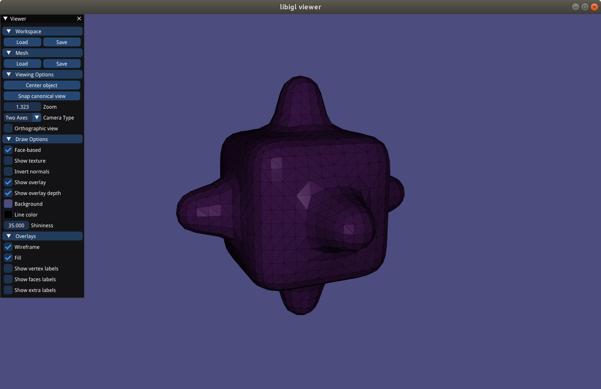  |   1                |  2496                      |
|bunny         |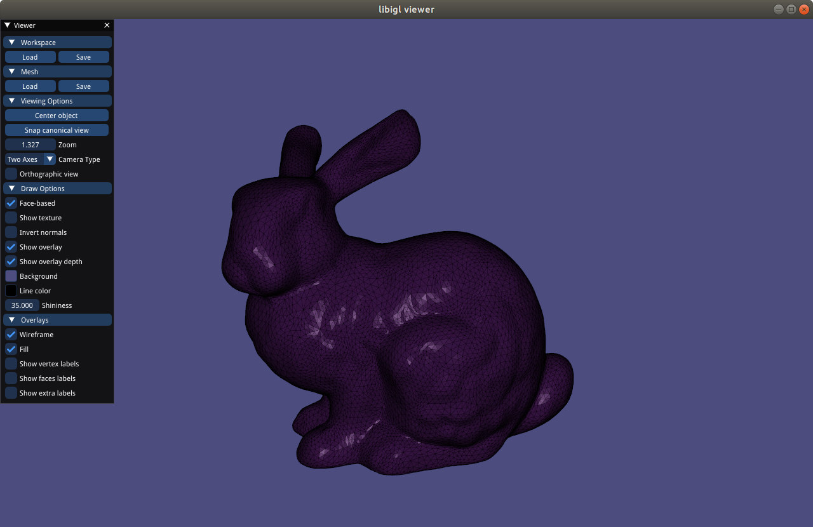  |   1                |  27864                     |
|coffeecup     |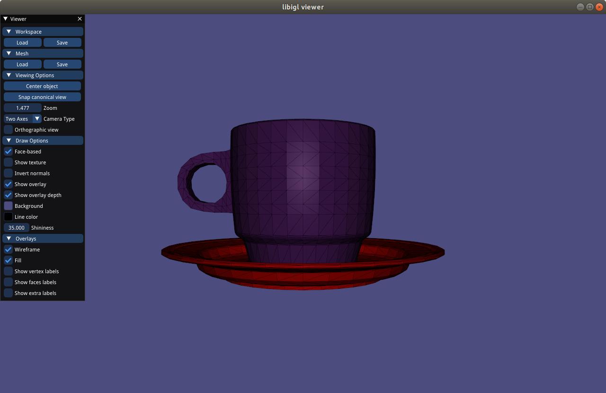 |   2                |  3360/2304                 |
|honda         |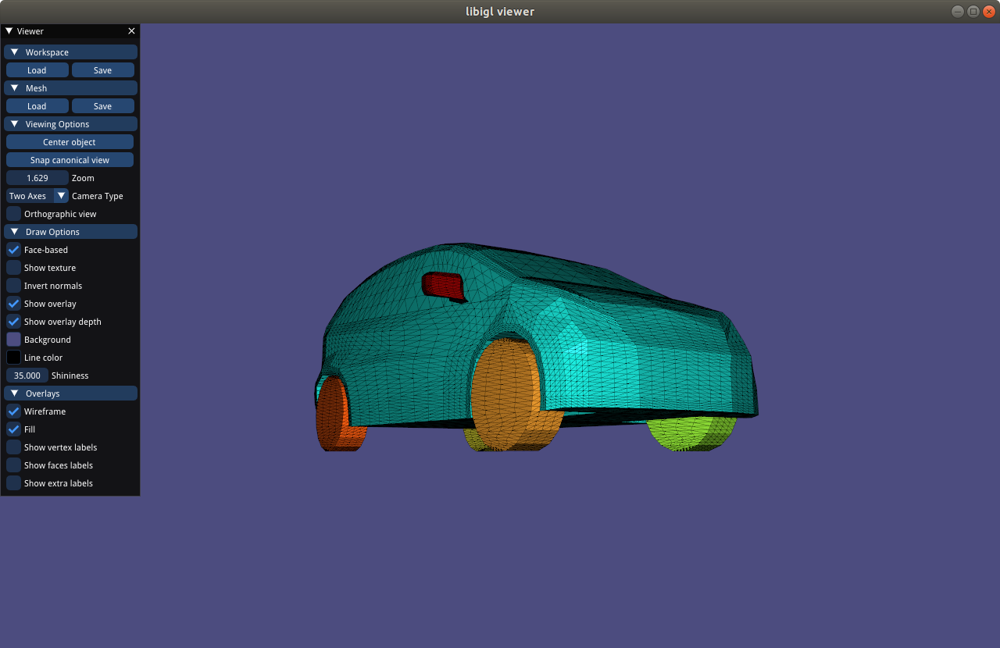  |   11               |  90/192/192/13216/704/1088/1088/1088/1088/736/736 |

### Screenshots of subdivided meshes. Make sure you enable the wireframe overlay.

#### Note:
All shapes except sphere subdivided once. Sphere subdivided three times to showcase the consecutive subdivision capability.

| model name | original shape                                               | subdivided shape                                             |
| :--------: | ------------------------------------------------------------ |--------------------------------------------------------------| 
| plane      |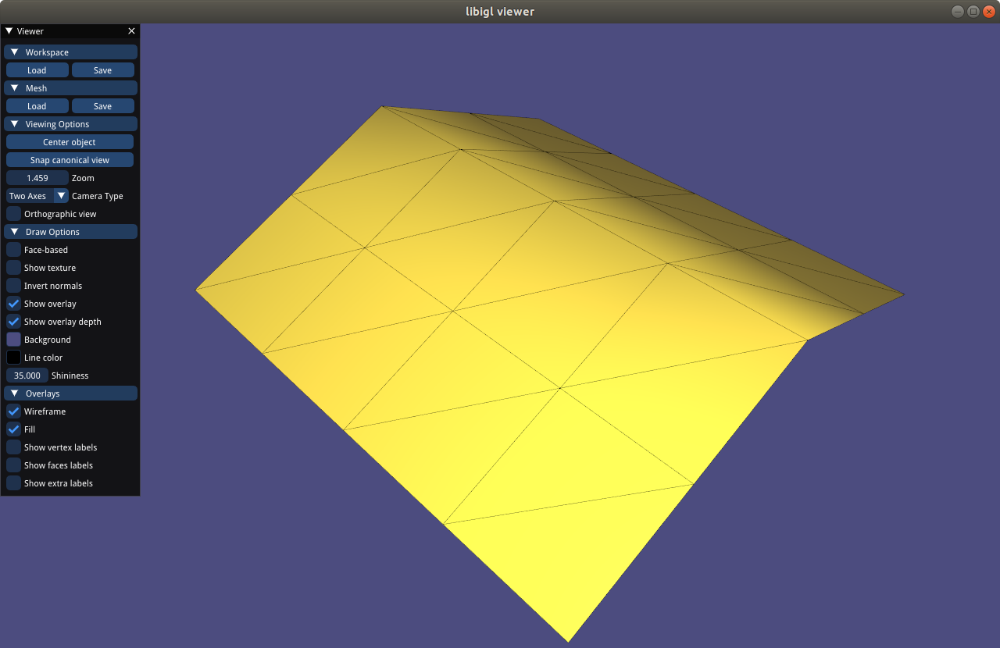 |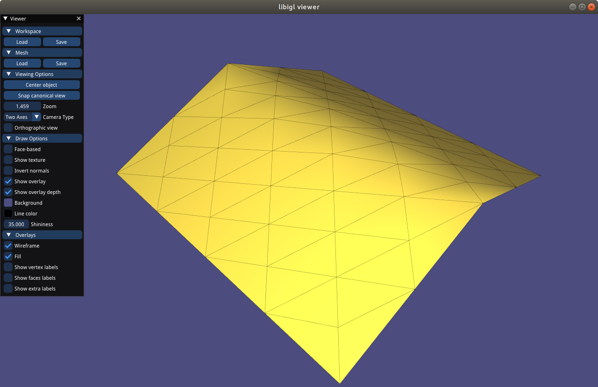   |
| sphere     |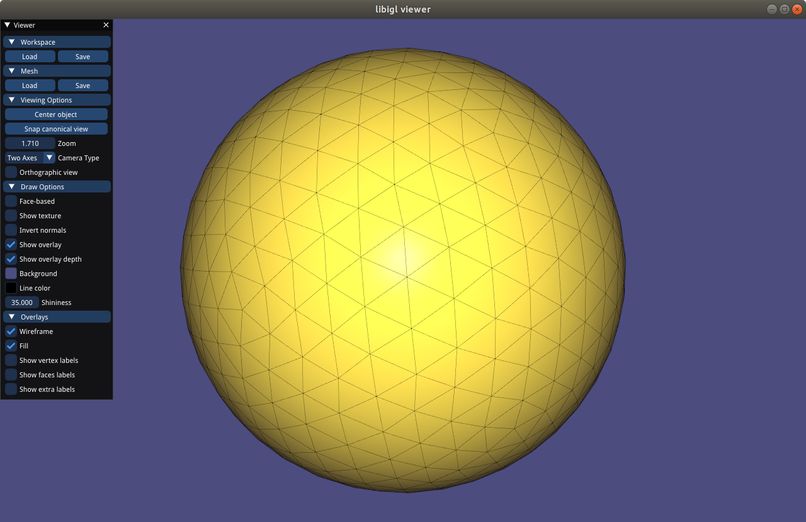 |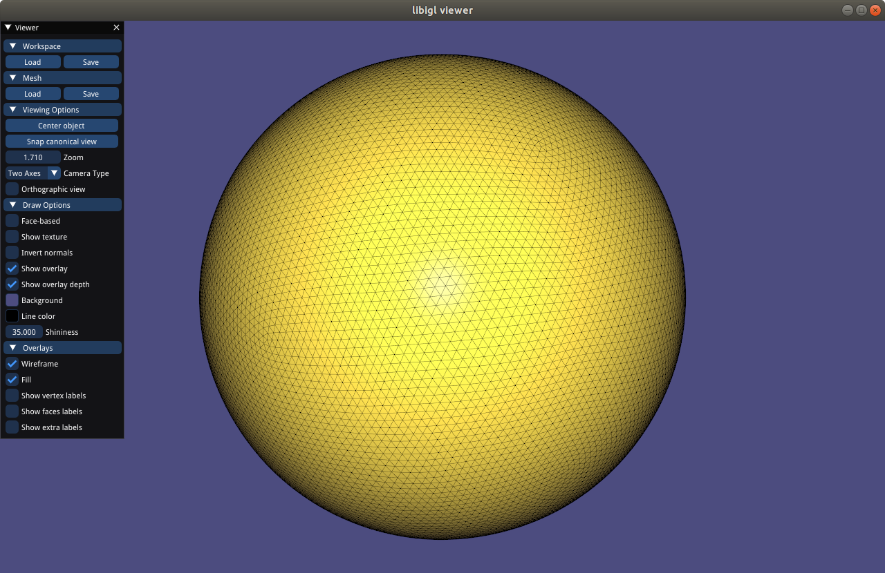  |
| bunny      |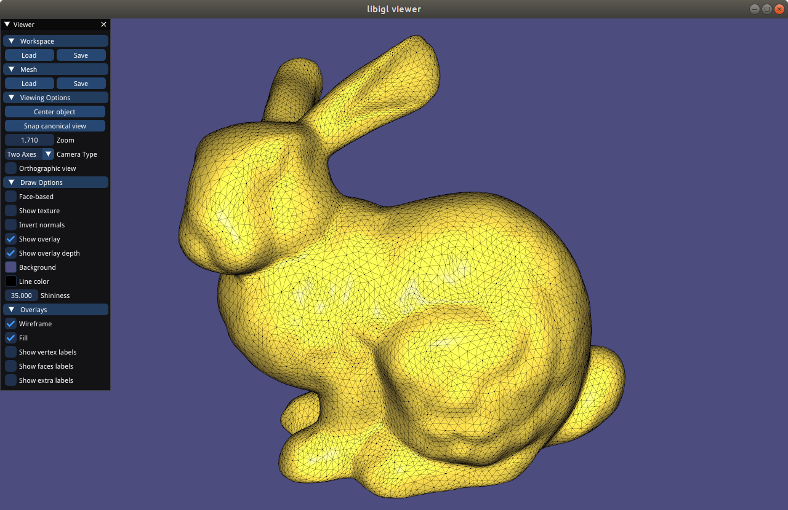 |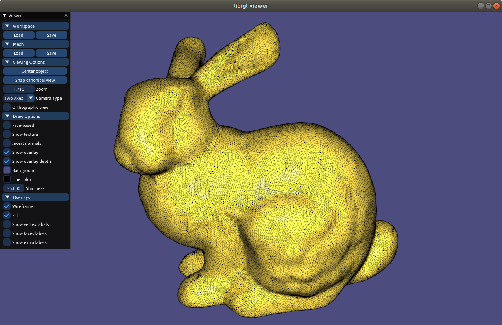   |
| bumpy_cube |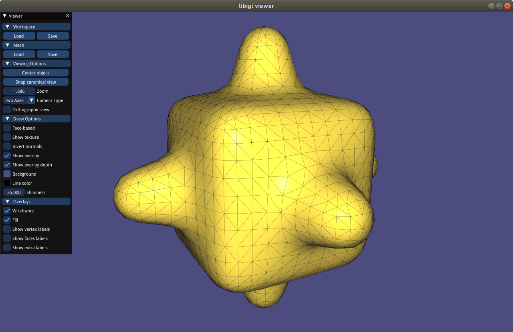 |   |

