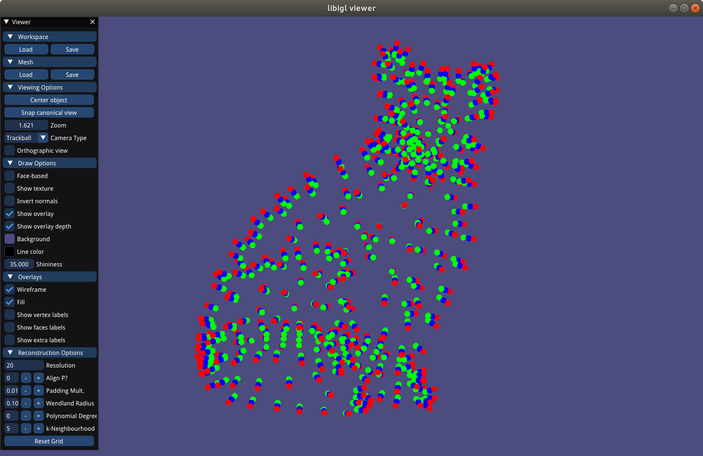
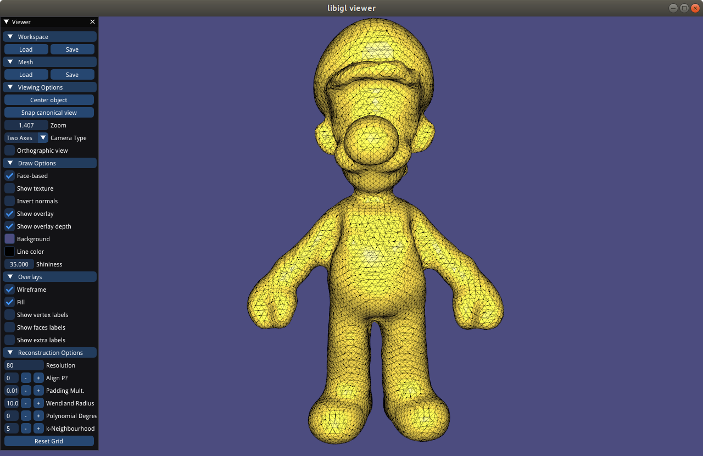

# Assignment 2
Name: 'Ertugrul Omer Alkaya'

Legi-Nr: '18-943-092'

## Required results
Edit this 'README.md' file to report all your results. You only need to update the tables in the reports section by adding screenshots and reporting results.

### Tasks
1) Show the visualization of the constrained points for the 'cat.off' point cloud.

2) Show screenshots of the grid with nodes colored according to their implicit function values (cat.off and luigi.off).

3) Show screenshots of the reconstructed surfaces. Experiment with different parameter settings: grid resolution (also anisotropic in the 3 axes), Wendland function radius, polynomial degree. Add all these settings to the GUI to ease experimentation. Briefly summarize your observations and save the reconstructed models in the .off format for every point-cloud dataset provided (assignment2/results).

4) Theory question (1): Save your notes to assignment2/results and link to them from within the report.

5) Theory question (2): Save your notes to assignment2/results and link to them from within the report.

6) Show screenshots comparing the 'hound.off' computed with normal-based reconstruction to the point-based reconstruction of the previous task.

7) Compare your MLS reconstruction results to the surfaces obtained with RIMLS and Screened Poisson Reconstruction, and inspect the differences. Report your findings.

8) Show screenshorts of your method for estimating normals based on Principal Component Analysis. Compare the results with the reconstruction obtained using the provided normals.

## Reports
### 1 - Visualization of the 'cat.off' point cloud with constrained points
| model name  | view 01             | view 02            |
| :---------: | ------------------- | ------------------ |
| cat         ||  |

### 2 - Grid with nodes colored w.r.t. the implicit function (using the non-axis-aligned grid as described in Section 2.3) 
| model name  | view 01             | view 02            |
| :---------: | ------------------- | ------------------ |
| cat         ||  |
| luigi      ||  |

### 3 - Reconstructed surfaces
**Please also save the reconstructed shape (.off) in the results folder**

| sphere                                                     | cat                                                           |
| :--------------------------------------------------------: |  :----------------------------------------------------------: | 
||  |
| luigi                                                      | horse                                                         |
||  |
| hound                                                      |                                                               |
||                                                               |

**Please summarize your observations of what happens when you change the following parameters. Please feel free to add screenshots (by creating a separate table) to illustrate your explanation.**

| params                   | Your Observation    | 
| :---------------------:  | ------------------- |
| grid resolution          |   Grid resolution affects how detailed the constructed mesh looks. Using lower resolutions (for example 20), Luigi's legs would not be separated from each other. Higher resolutions capture more details during reconstruction, such as the folds of the skin in hound.off. |
| Wendland function radius |   Very low wendland radius results in a completely red mesh, where all grid points do not have any other points within the wendland radius. In constrast, unreasonably high wendland radii mostly result in a slower mesh computation time. |
| polynomial degree        |   Non-zero polynomial degrees result in smoother meshes but additionally create floating disconnected meshes during reconstruction. |

**Please compare the computation time for constraints computation and MLS using brute force and a spatial index. Use hound.off for the comparison and use the same parameters for the timings with and without use of spatial index (please report the parameters that you used).**

In the following table for hound.off, the time required to preprocess the spatial index (3ms) is not included. Additionally resolution = 20 and wendlandRadius = 0.03, polyDegree = 0 for MLS.

| step                    | brute force         |  spatial index      |
| :---------------------: | :-----------------: | :-----------------: |
| constraints             |   1688ms            |    147ms            |
| MLS                     |   425ms             |    173ms            |

### 4 - Theory Question 1

**Prove that the normal of a surface defined by an implicit function is proportional to its gradient.**

Please show your answer in screenshot/photos (or link to a PDF). Make sure your answer is readable. You can add more pages by modifying the table.

| Proof 1:                |
| :---------------------: |
|  |

### 5 - Theory Question 2

**Compute the closed-form gradient of the MLS approximation.**

Please show your answer in screenshot/photos (or link to a PDF). Make sure your answer is readable. You can add more pages by modifying the table.

| Proof 2:                |
| :---------------------: |
|  |

### 6 - Normal-based v.s. point-based reconstruction ("hound.off")
| method       | view 01             | view 02            | comments           | 
| :---------:  | ------------------- | ------------------ | ------------------ |
| point-based  ||  | The neck region has a strong deformation. |
| normal-based ||  | The "hole" in the neck region seems smaller. |

### 7 - MLS v.s. Screened Poisson Reconstruction v.s. RIMLS

**No implementation required, you can use [Meshlab](https://www.meshlab.net) to perform the comparisons.**

| model names  | MLS          | Poisson             | RIMLS               | 
| :---------:  | :---------:  | :-----------------: | :-----------------: |
| cat          ||  | |
| luigi        ||  | |
| comments        | Reconstructed meshes from Exercise Part 2 being viewed in MeshLab | Poisson reduces the amount of "cubicness" of the reconstructed mesh. | Creates an extremely smooth surface. |

### 8 - PCA normals v.s. provided normals (luigi.off)

| model names  | PCA normals             |  Provided normals       | 
| :---------:  | :---------------------: | :---------------------: |
| luigi        |  |  |
| comments        | Luigi's hair has been incorrectly reconstructed. | Provided normals do not have the aforementioned artifact. |
