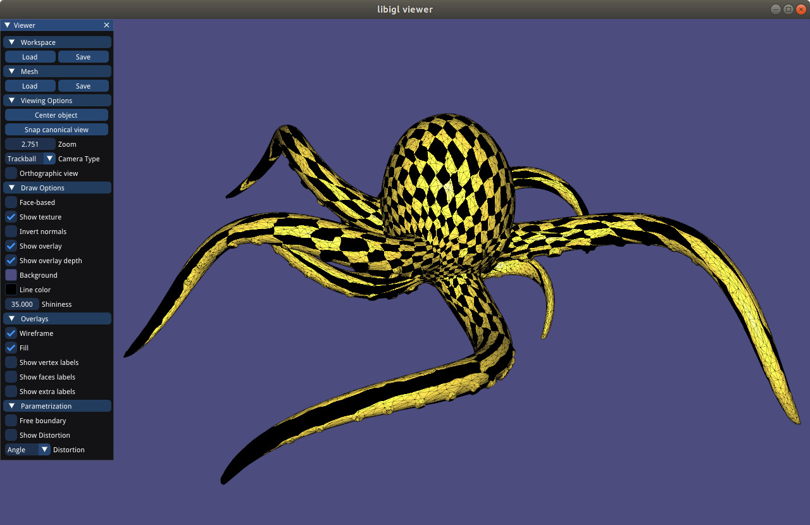
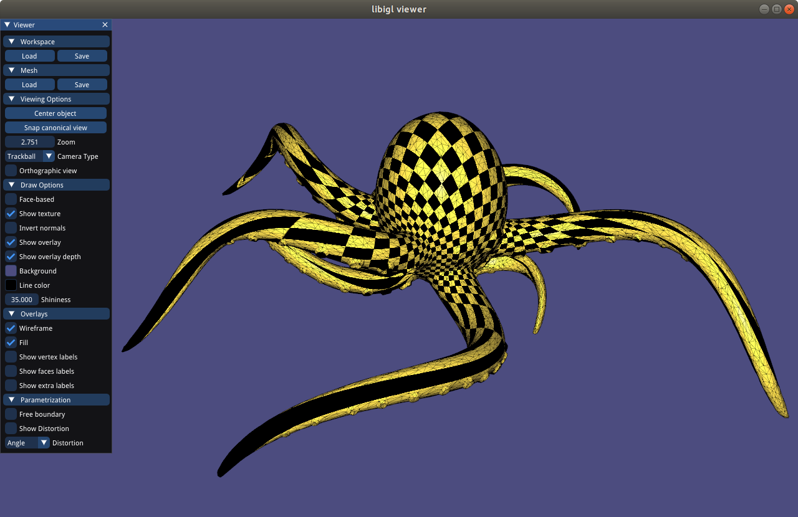

# Assignment 4

Name: 'Omer Alkaya'

Legi-Nr: '18-943-092'

## Reports
### Checkerboard Texture Models and Parameterization
#### Cat Head
| Method            | Checkerboard Textured Models          |         Parameterization             |
| :--------------:  | ------------------------------------- |------------------------------------- |
| Uniform (fixed)   |   |    |
| Cotangent (fixed) |       |        |
| LSCM (fixed)      || |
| ARAP (fixed)      || |
| LSCM (free)       | |  |
| ARAP (free)       | |  |

#### Hemisphere
| Method            | Checkerboard Textured Models          |         Parameterization             |
| :--------------:  | ------------------------------------- |------------------------------------- |
| Uniform (fixed)   |   |    |
| Cotangent (fixed) |       |        |
| LSCM (fixed)      || |
| ARAP (fixed)      || |
| LSCM (free)       | |  |
| ARAP (free)       | |  |

#### Hemisphere (Non-Convex-Boundary)
| Method            | Checkerboard Textured Models          |         Parameterization             |
| :--------------:  | ------------------------------------- |------------------------------------- |
| Uniform (fixed)   |   |    |
| Cotangent (fixed) |       |        |
| LSCM (fixed)      || |
| ARAP (fixed)      || |
| LSCM (free)       | |  |
| ARAP (free)       | |  |

#### Octopus
| Method            | Checkerboard Textured Models          |         Parameterization             |
| :--------------:  | ------------------------------------- |------------------------------------- |
| Uniform (fixed)   |   |    |
| Cotangent (fixed) |       |        |
| LSCM (fixed)      || |
| ARAP (fixed)      || |
| LSCM (free)       | |  |
| ARAP (free)       | |  |

### Distortion Visualization
| Colormap Turbo    |
| :--------------:  |
||
#### Cat Head
| Method\Metric      | Conformal (Angle) |    Authalic (Area)  |  Isometric  (Length)    |
| :--------------:  | ----------------- | ------------------- | ----------------------- |
| LSCM (free)       ||  |  |
| ARAP (free) ||  |  |

#### Hemisphere
| Method\Metric      | Conformal (Angle) |    Authalic (Area) |  Isometric  (Length)    |
| :--------------:  | ----------------- | ------------------- | ----------------------- |
| LSCM (free)       ||  |  |
| ARAP (free) ||  |  |

